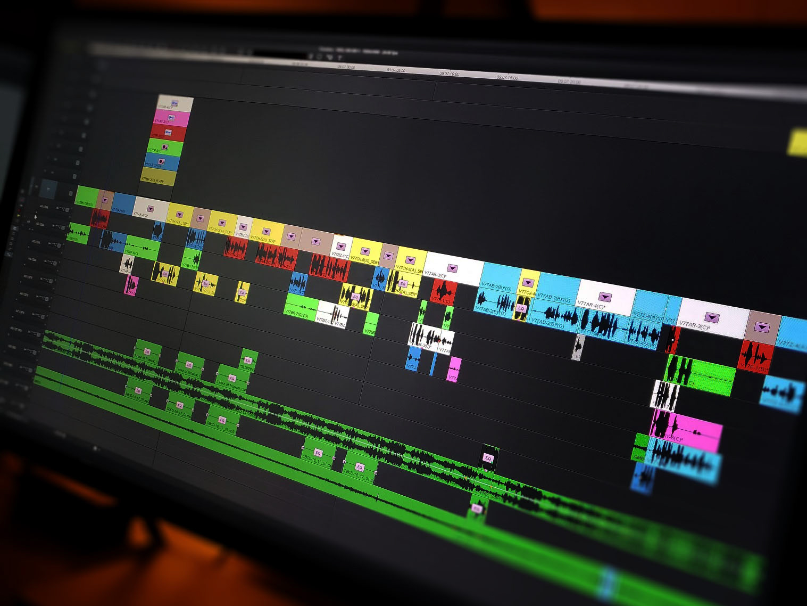

# Premiere MCP Server



**Unofficial MCP (Model Context Protocol) Server for Adobe Premiere Pro**

---

## Overview

This project provides an MCP-compatible server that enables advanced automation, querying, and remote control of Adobe Premiere Pro projects. It is designed for power users, workflow automation, and integration with AI or scripting tools.

> **Disclaimer**  
> This project is **not affiliated with, endorsed by, or supported by Adobe Inc.** in any way. It is a third-party tool developed independently for use with Adobe Premiere Pro.  
> **Use at your own risk.** No guarantees are made regarding functionality, compatibility, or safety. The author(s) accept no liability for any loss, damage, or data corruption that may result from use of this software.  
> Always back up your projects before use.

---

## Features & Available Tools

The server exposes the following tools via MCP API:

- **get_project_info**: Get basic information about the current Premiere Pro project
- **get_active_sequence_info**: Get detailed information about the currently active sequence
- **list_all_sequences**: List all sequences in the current project with basic info
- **get_sequence_details**: Get detailed information about a specific sequence including tracks, effects, and markers
- **get_timeline_structure**: Get the track structure of the active sequence
- **get_timeline_clips**: Get all clips in the active sequence with detailed information
- **get_project_media**: Get all media items in the project browser with file information
- **get_project_bins**: Get project bin structure and organization
- **get_playhead_info**: Get current playhead position and playback state
- **get_selection_info**: Get information about currently selected clips or time range
- **get_export_presets**: Get available export presets and their settings
- **get_render_queue**: Get current render queue status and items
- **create_sequence**: Create a new sequence in Premiere Pro
- **export_project**: Export the current project or sequence

---

## Requirements
- Adobe Premiere Pro (tested on latest versions)
- Node.js (LTS recommended)
- MCP-compatible client (optional, for automation)

---

## Installation & Usage Guide

### 1. Prerequisites
- **Adobe Premiere Pro** (latest or supported version installed)
- **Node.js** (LTS version recommended)
- **npm** (comes with Node.js)
- (Optional) **Claude Desktop** or any AI IDE that supports MCP server integration

### 2. Installation Steps

**a. Clone the Repository**
```sh
git clone https://github.com/yourusername/premiere-mcp-server.git
cd premiere-mcp-server
```

**b. Install Dependencies**
```sh
npm install
```

### 3. Running the Server

**Start the MCP server:**
```sh
node mcp-server.js
```
- The server should output a message indicating it is running and listening for MCP connections.

### 4. Connecting to Claude Desktop or an AI IDE

**a. Open Claude Desktop (or your AI IDE).**

**b. Add the Premiere MCP Server as a new MCP server:**
   - In Claude Desktop, go to the MCP server settings or integration panel.
   - Enter the address for your MCP server (typically `http://localhost:PORT`—replace `PORT` with the port your server uses, e.g., `http://localhost:3000`).
   - Save or apply the settings.

**c. Test the Connection:**
   - Claude Desktop (or your IDE) should now list the Premiere MCP Server and its available tools.
   - Try running a simple command (like `get_project_info`) to verify connectivity.

### 5. Using the Tools
- Once connected, you can invoke any of the available tools (see above) directly from your AI IDE or automation scripts.
- Example: Ask Claude Desktop to “list all sequences” or “export the current project.”

### 6. Troubleshooting
- **Server not connecting?**
  - Make sure Premiere Pro is running.
  - Ensure the MCP server is running (no errors in the terminal).
  - Double-check the server URL and port in your IDE.
  - If using a firewall, ensure the port is open.

### 7. Security & Disclaimer
- This project is not affiliated with or endorsed by Adobe.
- Use at your own risk. Always back up your projects.
- The author provides no guarantees or support for any data loss or issues.

---


## License
This project is licensed under the MIT License. See the [LICENSE](LICENSE) file for details.

---

**This project is not produced, endorsed, or supported by Adobe.**
